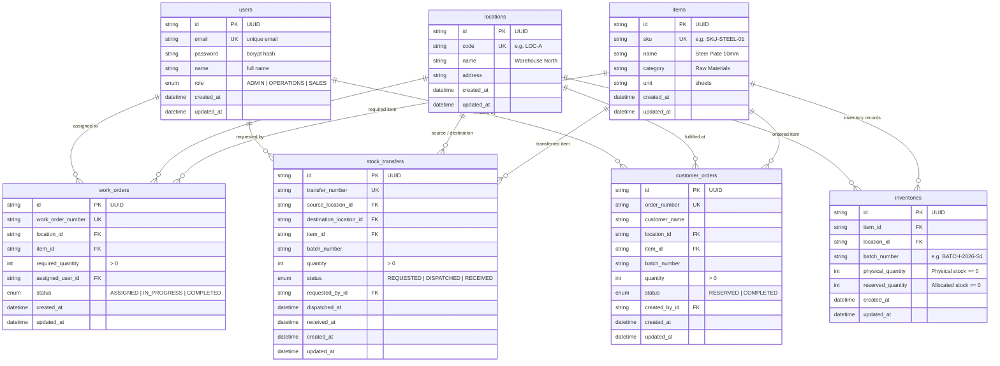

# Mini Operations ERP - Entity Relationship (ER) Diagram

## Inventory Invariants & Business Logic

1. **Available Quantity Formula**:
   $$\text{Available Quantity} = \text{Physical Quantity} - \text{Reserved Quantity}$$

2. **Integrity Constraints**:
   - $\text{Physical Quantity} \ge 0$
   - $\text{Reserved Quantity} \ge 0$
   - $\text{Reserved Quantity} \le \text{Physical Quantity}$
   - $\text{Available Quantity} \ge 0$
   - `@@unique([itemId, locationId, batchNumber])` prevents duplicate batch entries.

3. **Concurrency & Locking**:
   - Stock reservations and internal transfers use PostgreSQL `SELECT ... FOR UPDATE` inside atomic `prisma.$transaction`.
   - Prevents simultaneous overselling race conditions.